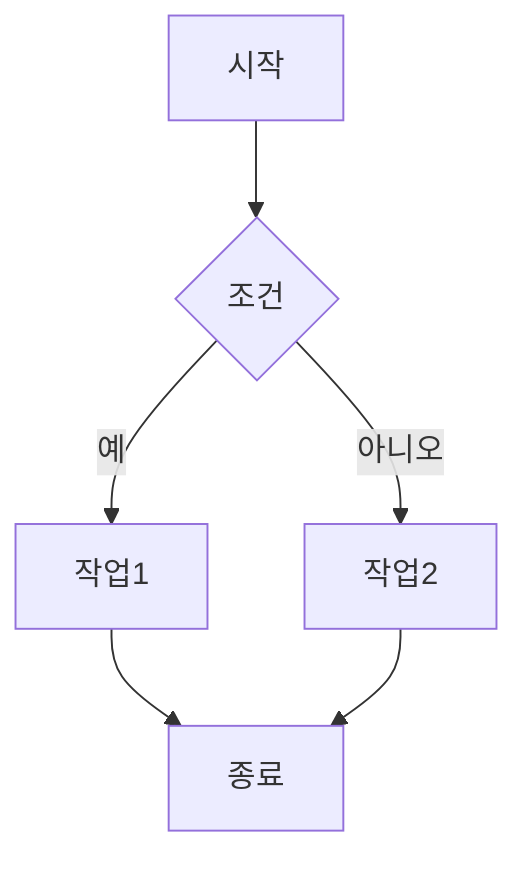
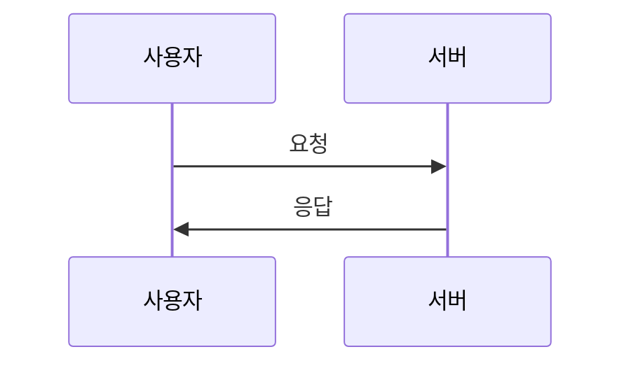
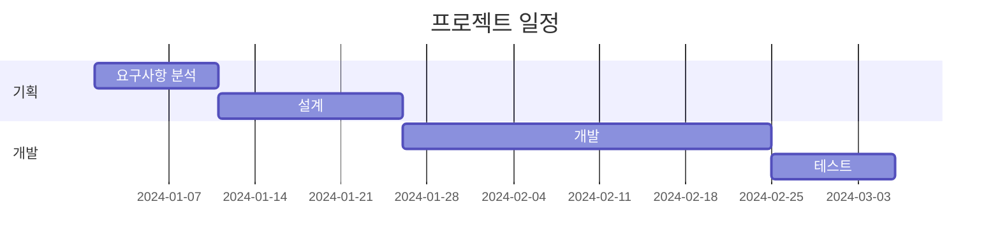
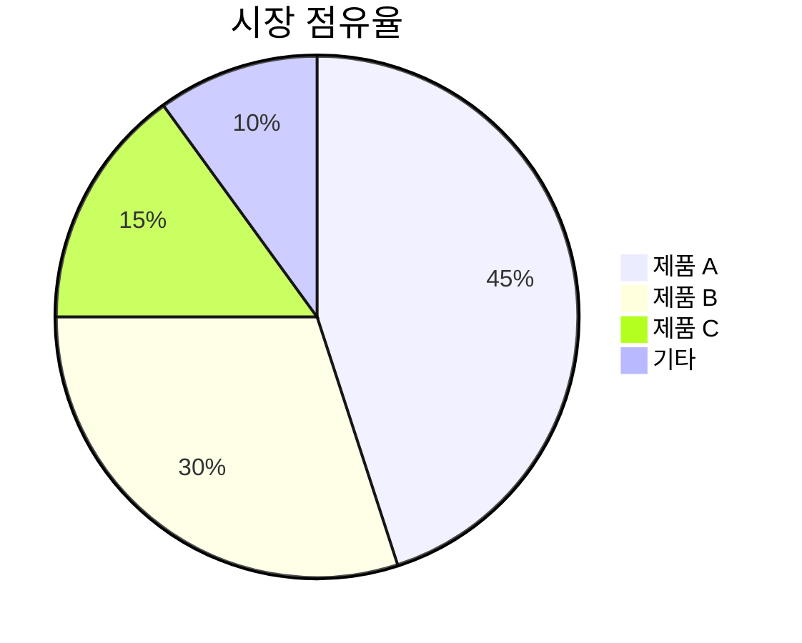
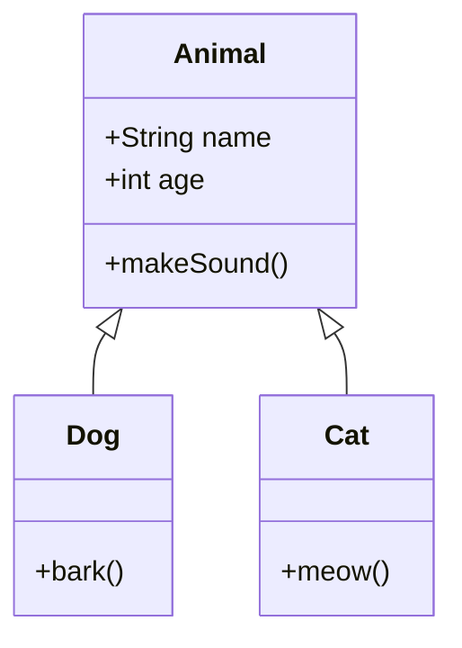

# 마크다운(Markdown) 완벽 가이드

마크다운은 텍스트 기반의 마크업 언어로, 읽기 쉽고 쓰기 쉬운 문서 작성을 위한 포맷입니다.

---

## 목차
1. [제목(Headers)](#제목headers)
2. [강조(Emphasis)](#강조emphasis)
3. [목록(Lists)](#목록lists)
4. [링크(Links)](#링크links)
5. [이미지(Images)](#이미지images)
6. [코드(Code)](#코드code)
7. [인용구(Blockquotes)](#인용구blockquotes)
8. [수평선(Horizontal Rules)](#수평선horizontal-rules)
9. [표(Tables)](#표tables)
10. [체크박스(Task Lists)](#체크박스task-lists)
11. [각주(Footnotes)](#각주footnotes)
12. [이스케이프(Escaping)](#이스케이프escaping)
13. [HTML 태그](#html-태그)
14. [수식(Math)](#수식math)
15. [다이어그램(Diagrams)](#다이어그램diagrams)
16. [접기/펼치기](#접기펼치기)
17. [이모지(Emoji)](#이모지emoji)
18. [배지(Badges)](#배지badges)

---

## 제목(Headers)

제목은 `#` 기호를 사용하여 작성합니다. `#`의 개수가 제목의 레벨을 결정합니다.

```markdown
# H1 제목
## H2 제목
### H3 제목
#### H4 제목
##### H5 제목
###### H6 제목
```

### 대체 문법

```markdown
H1 제목
=======

H2 제목
-------
```

---

## 강조(Emphasis)

### 기울임(Italic)

```markdown
*별표로 감싸기*
_언더스코어로 감싸기_
```

결과: *별표로 감싸기* _언더스코어로 감싸기_

### 굵게(Bold)

```markdown
**별표 두 개로 감싸기**
__언더스코어 두 개로 감싸기__
```

결과: **별표 두 개로 감싸기** __언더스코어 두 개로 감싸기__

### 굵은 기울임(Bold + Italic)

```markdown
***별표 세 개***
___언더스코어 세 개___
**_혼합 사용_**
*__혼합 사용2__*
```

결과: ***별표 세 개*** ___언더스코어 세 개___

### 취소선(Strikethrough)

```markdown
~~취소선~~
```

결과: ~~취소선~~

### 밑줄(Underline)

```markdown
<u>밑줄</u>
```

결과: <u>밑줄</u>

### 형광펜(Highlight)

```markdown
==형광펜 효과==
<mark>형광펜 효과</mark>
```

결과: <mark>형광펜 효과</mark>

### 위첨자와 아래첨자

```markdown
H<sub>2</sub>O (아래첨자)
X<sup>2</sup> (위첨자)
```

결과: H<sub>2</sub>O, X<sup>2</sup>

---

## 목록(Lists)

### 순서 없는 목록(Unordered List)

```markdown
* 항목 1
* 항목 2
  * 하위 항목 2-1
  * 하위 항목 2-2
* 항목 3

- 항목 1 (하이픈 사용)
+ 항목 2 (플러스 사용)
```

결과:
* 항목 1
* 항목 2
  * 하위 항목 2-1
  * 하위 항목 2-2
* 항목 3

### 순서 있는 목록(Ordered List)

```markdown
1. 첫 번째
2. 두 번째
3. 세 번째
   1. 하위 항목 3-1
   2. 하위 항목 3-2
4. 네 번째
```

결과:
1. 첫 번째
2. 두 번째
3. 세 번째
   1. 하위 항목 3-1
   2. 하위 항목 3-2
4. 네 번째

### 혼합 목록

```markdown
1. 첫 번째 항목
   - 하위 항목
   - 하위 항목
2. 두 번째 항목
   * 하위 항목
```

---

## 링크(Links)

### 인라인 링크

```markdown
[링크 텍스트](https://www.example.com)
[링크 텍스트](https://www.example.com "링크 제목")
```

결과: [링크 텍스트](https://www.example.com)

### 참조 링크

```markdown
[링크 텍스트][참조명]
[링크 텍스트2][1]

[참조명]: https://www.example.com
[1]: https://www.example.com
```

### URL 자동 링크

```markdown
<https://www.example.com>
<email@example.com>
```

결과: <https://www.example.com>

### 내부 링크(앵커)

```markdown
[목차로 이동](#목차)
```

---

## 이미지(Images)

### 기본 이미지

```markdown


```

### 참조 이미지

```markdown
![대체 텍스트][이미지참조]

[이미지참조]: 이미지URL "이미지 제목"
```

### 이미지에 링크 추가

```markdown
[](링크URL)
```

### HTML을 사용한 이미지 크기 조절

```markdown

```

### 이미지 정렬

```markdown
<p align="center">
  
</p>
```

---

## 코드(Code)

### 인라인 코드

```markdown
`인라인 코드`는 백틱으로 감쌉니다.
```

결과: `인라인 코드`는 백틱으로 감쌉니다.

### 코드 블록

#### 백틱 사용

````markdown
```
코드 블록
여러 줄 작성 가능
```
````

#### 언어 지정 (Syntax Highlighting)

````markdown
```python
def hello_world():
    print("Hello, World!")
```

```javascript
function helloWorld() {
    console.log("Hello, World!");
}
```

```java
public class HelloWorld {
    public static void main(String[] args) {
        System.out.println("Hello, World!");
    }
}
```

```html
<!DOCTYPE html>
<html>
<head>
    <title>Hello</title>
</head>
<body>
    <h1>Hello, World!</h1>
</body>
</html>
```

```css
.hello {
    color: blue;
    font-size: 16px;
}
```

```bash
echo "Hello, World!"
ls -la
```

```sql
SELECT * FROM users WHERE id = 1;
```

```json
{
    "name": "John",
    "age": 30
}
```
````

#### 들여쓰기 사용 (4칸 또는 탭)

```markdown
    코드 블록
    들여쓰기로 작성
```

---

## 인용구(Blockquotes)

### 기본 인용구

```markdown
> 이것은 인용구입니다.
> 여러 줄로 작성할 수 있습니다.
```

결과:
> 이것은 인용구입니다.
> 여러 줄로 작성할 수 있습니다.

### 중첩 인용구

```markdown
> 첫 번째 인용구
>> 두 번째 인용구
>>> 세 번째 인용구
```

결과:
> 첫 번째 인용구
>> 두 번째 인용구
>>> 세 번째 인용구

### 인용구 내 다른 마크다운 사용

```markdown
> ### 제목도 가능
> * 목록도 가능
> **굵은 글씨**도 가능
> 
> `코드`도 가능
```

---

## 수평선(Horizontal Rules)

세 개 이상의 `-`, `*`, `_`를 사용합니다.

```markdown
---
***
___
```

결과:

---

***

___

---

## 표(Tables)

### 기본 표

```markdown
| 헤더1 | 헤더2 | 헤더3 |
|-------|-------|-------|
| 내용1 | 내용2 | 내용3 |
| 내용4 | 내용5 | 내용6 |
```

결과:

| 헤더1 | 헤더2 | 헤더3 |
|-------|-------|-------|
| 내용1 | 내용2 | 내용3 |
| 내용4 | 내용5 | 내용6 |

### 정렬

```markdown
| 왼쪽 정렬 | 중앙 정렬 | 오른쪽 정렬 |
|:----------|:---------:|-----------:|
| 내용1     | 내용2     | 내용3      |
| 내용4     | 내용5     | 내용6      |
```

결과:

| 왼쪽 정렬 | 중앙 정렬 | 오른쪽 정렬 |
|:----------|:---------:|-----------:|
| 내용1     | 내용2     | 내용3      |
| 내용4     | 내용5     | 내용6      |

### 표 내 마크다운 사용

```markdown
| 기능 | 문법 | 예시 |
|------|------|------|
| 굵게 | `**텍스트**` | **굵은 글씨** |
| 기울임 | `*텍스트*` | *기울임* |
| 코드 | `` `코드` `` | `code` |
| 링크 | `[텍스트](URL)` | [링크](https://example.com) |
```

---

## 체크박스(Task Lists)

```markdown
- [x] 완료된 작업
- [x] 완료된 작업2
- [ ] 미완료 작업
- [ ] 미완료 작업2
  - [x] 하위 완료 작업
  - [ ] 하위 미완료 작업
```

결과:

- [x] 완료된 작업
- [x] 완료된 작업2
- [ ] 미완료 작업
- [ ] 미완료 작업2
  - [x] 하위 완료 작업
  - [ ] 하위 미완료 작업

---

## 각주(Footnotes)

```markdown
여기에 각주를 추가합니다[^1].
또 다른 각주[^2].

[^1]: 첫 번째 각주 내용입니다.
[^2]: 두 번째 각주 내용입니다.
```

결과:

여기에 각주를 추가합니다[^1].
또 다른 각주[^2].

[^1]: 첫 번째 각주 내용입니다.
[^2]: 두 번째 각주 내용입니다.

---

## 이스케이프(Escaping)

마크다운 특수 문자를 그대로 표시하려면 백슬래시(`\`)를 사용합니다.

```markdown
\* 별표
\_ 언더스코어
\# 해시
\[ 대괄호
\] 대괄호
\( 소괄호
\) 소괄호
\\ 백슬래시
\` 백틱
```

결과:
\* 별표
\_ 언더스코어
\# 해시

---

## HTML 태그

마크다운 내에서 HTML 태그를 직접 사용할 수 있습니다.

```markdown
<div style="color: red;">
  빨간색 텍스트
</div>

<details>
<summary>클릭하여 펼치기</summary>

숨겨진 내용입니다.

</details>

<kbd>Ctrl</kbd> + <kbd>C</kbd>

<br>

<hr>
```

결과:

<div style="color: red;">
  빨간색 텍스트
</div>

<kbd>Ctrl</kbd> + <kbd>C</kbd>

---

## 수식(Math)

### 인라인 수식

```markdown
$E = mc^2$
```

### 블록 수식

```markdown
$$
\int_{a}^{b} f(x) dx
$$

$$
\begin{aligned}
a &= b + c \\
d &= e + f
\end{aligned}
$$
```

### 주요 수식 예제

```markdown
$\alpha, \beta, \gamma, \delta$

$\sum_{i=1}^{n} x_i$

$\frac{a}{b}$

$\sqrt{x}$

$x^2 + y^2 = z^2$

$\lim_{x \to \infty} f(x)$
```

---

## 다이어그램(Diagrams)

### Mermaid 다이어그램

#### 플로우차트

````markdown

````

#### 시퀀스 다이어그램

````markdown

````

#### 간트 차트

````markdown

````

#### 파이 차트

````markdown

````

#### 클래스 다이어그램

````markdown

````

---

## 접기/펼치기

```markdown
<details>
<summary>클릭하여 펼치기</summary>

여기에 숨겨진 내용을 작성합니다.

* 목록도 가능
* 코드도 가능

```python
print("Hello")
```

</details>
```

결과:

<details>
<summary>클릭하여 펼치기</summary>

여기에 숨겨진 내용을 작성합니다.

* 목록도 가능
* 코드도 가능

```python
print("Hello")
```

</details>

---

## 이모지(Emoji)

### 단축키 사용

```markdown
:smile: :heart: :thumbsup: :fire: :rocket:
:+1: :-1: :eyes: :tada: :sparkles:
```

결과: :smile: :heart: :thumbsup: :fire: :rocket:

### 유니코드 사용

```markdown
😀 😃 😄 😁 😆 😅 😂 🤣
❤️ 💙 💚 💛 🧡 💜 🖤 🤍
👍 👎 👏 🙌 🤝 💪 🔥 ⭐
```

결과: 😀 😃 😄 😁 😆 😅 😂 🤣

---

## 배지(Badges)

Shields.io를 사용한 배지 예제:

```markdown


```

---

## 고급 기능

### 정의 목록

```markdown
용어 1
: 정의 1

용어 2
: 정의 2-1
: 정의 2-2
```

### 약어

```markdown
*[HTML]: Hyper Text Markup Language
*[CSS]: Cascading Style Sheets

HTML과 CSS는 웹 개발의 기초입니다.
```

### 주석

```markdown
<!-- 이것은 주석입니다. 렌더링되지 않습니다. -->

[//]: # (이것도 주석입니다)
[comment]: # (이것도 주석입니다)
```

### 줄바꿈

```markdown
첫 번째 줄  
두 번째 줄 (공백 2개 또는 <br> 사용)

첫 번째 줄<br>
두 번째 줄
```

### 색상 표시

```markdown
`#FF0000` 빨강
`#00FF00` 초록
`#0000FF` 파랑

```diff
+ 추가된 내용 (초록색)
- 삭제된 내용 (빨간색)
! 경고 내용 (주황색)
# 주석 (회색)
```
````

---

## GitHub 특화 기능

### 사용자 멘션

```markdown
@username
```

### 이슈/PR 참조

```markdown
#123 (이슈 번호)
username/repo#123 (다른 저장소)
```

### 커밋 참조

```markdown
commit SHA: 16c999e8c71134401a78d4d46435517b2271d6ac
```

### 알림 블록

```markdown
> [!NOTE]
> 유용한 정보입니다.

> [!TIP]
> 도움이 되는 팁입니다.

> [!IMPORTANT]
> 중요한 정보입니다.

> [!WARNING]
> 주의가 필요한 내용입니다.

> [!CAUTION]
> 위험한 내용입니다.
```

---

## 유용한 팁

### 1. 들여쓰기
- 목록이나 인용구 내에서 다른 요소를 포함할 때는 적절한 들여쓰기를 사용하세요.

### 2. 빈 줄
- 블록 요소 사이에는 빈 줄을 넣어 가독성을 높이세요.

### 3. 일관성
- 한 문서 내에서는 일관된 스타일을 유지하세요 (예: `*` vs `-` 선택).

### 4. 미리보기
- 작성 중에는 항상 미리보기를 확인하세요.

### 5. 플랫폼 차이
- GitHub, GitLab, Notion 등 플랫폼마다 지원하는 기능이 다를 수 있습니다.

---

## 참고 자료

- [CommonMark Spec](https://commonmark.org/)
- [GitHub Flavored Markdown](https://github.github.com/gfm/)
- [Markdown Guide](https://www.markdownguide.org/)
- [Daring Fireball - Markdown](https://daringfireball.net/projects/markdown/)

---

## 마크다운 에디터 추천

1. **Visual Studio Code** - 강력한 확장 기능
2. **Typora** - WYSIWYG 스타일
3. **Obsidian** - 노트 관리
4. **Notion** - 협업 도구
5. **Mark Text** - 오픈소스
6. **StackEdit** - 온라인 에디터
7. **Dillinger** - 온라인 에디터

---

## 빠른 참조표

| 기능 | 문법 |
|------|------|
| 제목 | `# H1` ~ `###### H6` |
| 굵게 | `**텍스트**` 또는 `__텍스트__` |
| 기울임 | `*텍스트*` 또는 `_텍스트_` |
| 취소선 | `~~텍스트~~` |
| 인라인 코드 | `` `코드` `` |
| 코드 블록 | ` ``` ` 또는 들여쓰기 4칸 |
| 링크 | `[텍스트](URL)` |
| 이미지 | `` |
| 인용구 | `> 텍스트` |
| 순서 없는 목록 | `* 항목` 또는 `- 항목` |
| 순서 있는 목록 | `1. 항목` |
| 수평선 | `---` 또는 `***` |
| 체크박스 | `- [ ]` 또는 `- [x]` |
| 표 | `\| 헤더 \| 헤더 \|` |

---

**작성일**: 2024년  
**버전**: 1.0  
**라이선스**: MIT

이 가이드가 마크다운 학습에 도움이 되길 바랍니다! 🚀

